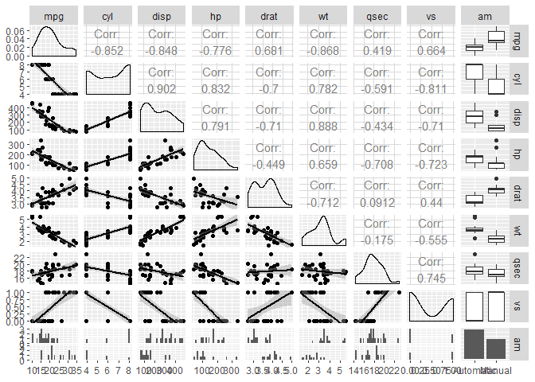
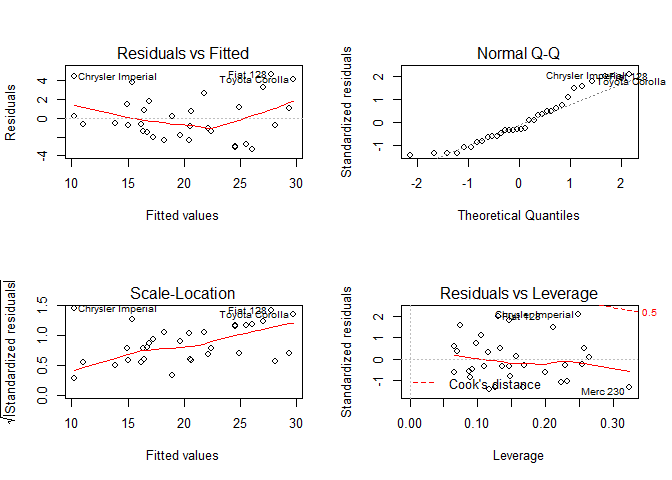

##Overview

The purpose of this report is to determine whether a car's transmission, automatic or manual, has an impact on the gasoline miles per gallon. To perform the analysis, we are using the mtcars dataset. The dataset was extracted from the 1974 Motor Trend magazine and contains the fuel consumption and 10 other aspects of automobile design and performance for 32 automobiles.

##Prepare the Data

Load the dataset mtcars and prepare the data for further analysis.


```r
data("mtcars")
mtcars$am<-factor(mtcars$am, levels = c(0,1), labels = c("Automatic", "Manual"))
```

##Analysis

We will first look at the coefficients of a simple linear model using mpg as the outcome and am as the predictor.


```r
fitAm<-lm(mpg ~ am, mtcars)
summary(fitAm)$coef
```

```
##              Estimate Std. Error   t value     Pr(>|t|)
## (Intercept) 17.147368   1.124603 15.247492 1.133983e-15
## amManual     7.244939   1.764422  4.106127 2.850207e-04
```

```r
summary(fitAm)$r.squared
```

```
## [1] 0.3597989
```

Vehicles in the dataset with a manual transmission averaged 7.2449393 more mpg than automatic transmissions which averaged 17.1473684. Based on the P-Value above, a significant relationship does exist between mpg and transmission type. However, only approximately 35% of the variance can be explained by transmission type alone. Using the correlation plot from the appendix, we selected additional predictors.


```r
fit2pred<-update(fitAm, mpg ~ am + drat)
fit3pred<-update(fitAm, mpg ~ am + drat + qsec)
fit4pred<-update(fitAm, mpg ~ am + drat + qsec + wt)
anova(fitAm, fit2pred, fit3pred, fit4pred)
```

```
## Analysis of Variance Table
## 
## Model 1: mpg ~ am
## Model 2: mpg ~ am + drat
## Model 3: mpg ~ am + drat + qsec
## Model 4: mpg ~ am + drat + qsec + wt
##   Res.Df    RSS Df Sum of Sq      F    Pr(>F)    
## 1     30 720.90                                  
## 2     29 573.64  1    147.26 23.682 4.361e-05 ***
## 3     28 323.97  1    249.67 40.152 8.758e-07 ***
## 4     27 167.89  1    156.09 25.102 2.963e-05 ***
## ---
## Signif. codes:  0 '***' 0.001 '**' 0.01 '*' 0.05 '.' 0.1 ' ' 1
```

Based on the ANOVA analysis, there are additional predictors of mpg.


```r
summary(fit4pred)$coef
```

```
##               Estimate Std. Error    t value     Pr(>|t|)
## (Intercept)  7.6277466  8.2102682  0.9290496 3.610954e-01
## amManual     2.5728751  1.6225267  1.5857213 1.244465e-01
## drat         0.6429296  1.3551408  0.4744375 6.390028e-01
## qsec         1.1958078  0.2995350  3.9922141 4.517773e-04
## wt          -3.8039824  0.7592452 -5.0102160 2.963097e-05
```

```r
summary(fit4pred)$r.squared
```

```
## [1] 0.8509065
```

##Conclusion

The R-squared value of 0.8509 suggests that approximately 85% of the variance is explained by the multivariable model, which includes transmission, rear axle ratio, quarter mile time, and weight as predictors of miles per gallon. The P-values of quarter mile time and weight suggest that they are confounding variables in the relationship between transmission type and miles per gallon. 

##Appendix


```r
require(GGally)
```

```
## Loading required package: GGally
```

```
## Warning: package 'GGally' was built under R version 3.5.3
```

```
## Loading required package: ggplot2
```

```
## Warning: package 'ggplot2' was built under R version 3.5.2
```

```r
require(ggplot2)
ggpairs(mtcars[, c(1:9)], lower = list(continuous = "smooth"))
```

```
## `stat_bin()` using `bins = 30`. Pick better value with `binwidth`.
```

```
## `stat_bin()` using `bins = 30`. Pick better value with `binwidth`.
## `stat_bin()` using `bins = 30`. Pick better value with `binwidth`.
## `stat_bin()` using `bins = 30`. Pick better value with `binwidth`.
## `stat_bin()` using `bins = 30`. Pick better value with `binwidth`.
## `stat_bin()` using `bins = 30`. Pick better value with `binwidth`.
## `stat_bin()` using `bins = 30`. Pick better value with `binwidth`.
## `stat_bin()` using `bins = 30`. Pick better value with `binwidth`.
```

<!-- -->


```r
par(mfrow = c(2, 2))
plot(fit4pred)
```

<!-- -->
